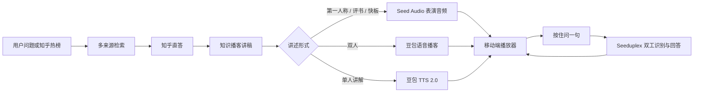

# 听海 Tinghai

> 把知乎里有出处的知识，变成一档能随时插话的个人播客。

听海是一款面向移动端的知识音频产品。用户可以从知乎热榜、知乎搜索、知乎知识库和全网搜索中选择一个问题，也可以直接输入自己的好奇；听海先保留真实来源，再把回答改编成不同风格的节目。播放过程中，用户可以按住“问一句”打断主持人，节目会暂停并以语音回答，然后回到被打断的位置继续。

当前仓库包含完整前后端、15 期预置节目、移动端交互、模型提示词、诊断工具与自动化测试。项目以黑客松演示为目标，优先保证核心链路可解释、可复现。

## 核心体验

1. **发现问题**：浏览五个主题分类和 15 期预置节目，或查看实时知乎热榜。
2. **检索与核验**：组合知乎搜索、热榜、知识库和全网搜索；回答中的引用只映射到真实检索材料。
3. **选择听法**：单人讲解、双人播客、第一人称、评书、快板五种形式；双人模式支持两种互斥音色。
4. **先听首章**：首章音频准备好后立即进入播放器，其余章节继续生成。
5. **边听边问**：长按“问一句”立即暂停原节目，实时识别问题并生成语音回答，结束后继续播放。
6. **继续收听**：播放器支持章节、讲稿逐句高亮、15 秒快进/后退、倍速、收藏、历史和可选连续播放。

## 产品亮点

- **音频是主界面**：搜索只是入口，用户最终进入一屏式播放器，而不是停留在传统 Agent 对话框。
- **来源可追溯**：保留标题、作者、渠道、原始链接与引用编号，来源不足时明确提示。
- **对话式双人播客**：提示词把角色反差、接话、打断、共同举例和观点校准写成可执行规则，避免两个人轮流念稿。
- **节目内插话**：识别、回答和声音在同一个双工会话中完成；资料不足时可调用知乎检索工具。
- **即时开始**：生成页以首章就绪为目标，减少等待整期音频的时间。
- **面向演示的可靠性**：15 期预置节目可离线复用；所有 API 调用都有脱敏 JSONL 与 `.log` 记录。

## 技术流程



浏览器只访问同源接口。知乎 Access Secret、OAuth App Key 和火山 API Key 均保留在服务端；签名上下文用于约束后续讲稿、语音与追问只能基于已验证的节目数据。

## 接入能力

| 环节 | 服务 / 模型 | 用途 |
|---|---|---|
| 知识来源 | 知乎搜索、知乎热榜、知乎知识库、全网搜索、问题回答 | 检索事实、观点与原始链接 |
| 回答与讲稿 | `zhida-fast-1p5`、`zhida-thinking-1p5`、`zhida-agent` | 回答、补充检索、播客改编 |
| 双人节目 | 豆包语音播客 | 生成多角色节目音频 |
| 单人及风格化讲述 | 豆包 TTS 2.0 | 生成单人、第一人称、评书、快板音频 |
| 节目内插话 | Seeduplex `1.2.6.1` | 语音识别、回答、语音输出与按需知乎检索 |
| 语音回退 | 流式 ASR 2.0 + 知乎直答 + TTS | 双工失败时的备用链路 |

当前可选音色定义在 `server/voice.mjs`，讲稿和主持人约束集中在 `server/host-prompts.mjs` 与 `server/duplex-text.mjs`。

## 目录

```text
public/                 移动端前端、播放器、交互与视觉素材
server/                 知乎、直答、语音、双工和 OAuth 服务端逻辑
content/catalog/        15 期预置节目的讲稿、来源与音频包
scripts/                本地服务、构建、缓存、日志和预置节目工具
test/                   Node 自动化测试
diagnostics/            火山语音和日志的独立复测工具
docs/                   部署、发现页与提交材料
.openai/hosting.json    Sites Worker 项目标识
```

## 本地运行

要求 Node.js 22 或以上。

```bash
npm ci
cp .env.example .env.local
npm run dev
```

Windows PowerShell 可以使用：

```powershell
Copy-Item .env.example .env.local
npm run dev
```

打开 `http://127.0.0.1:4173/`。至少配置：

```dotenv
ZHIHU_ACCESS_SECRET=你的知乎开放平台 Access Secret
VOLC_API_KEY=你的火山引擎 API Key
```

OAuth 为可选能力：

```dotenv
ZHIHU_OAUTH_APP_ID=
ZHIHU_OAUTH_APP_KEY=
ZHIHU_OAUTH_REDIRECT_URI=https://你的公网域名/auth/callback
```

本地顶部工具栏可以直接恢复测试节目和最近生成的完整节目。预置节目优先读取 `.local-cache/catalog/`，没有本机缓存时读取仓库内的 `content/catalog/`，因此克隆仓库后无需重新生成 15 期音频。插话仍会调用真实服务并消耗额度。

## 验证与构建

```bash
npm test
npm run build
```

构建产物写入 `dist/`。当前 Worker 构建包含前端和动态 API，不把约 39 MB 的预置节目包内嵌进 Worker；正式部署时应把 `content/catalog/` 迁移到对象存储，并将节目读取接口替换为生产服务。直接克隆后的本地演示已包含完整预置内容。

本地 API 日志写入被 Git 忽略的 `log/`：

- `YYYY-MM-DD.jsonl`：便于程序逐行处理。
- `YYYY-MM-DD.log`：便于人工追查。
- 记录时间、输入、模型、输出摘要、请求 ID、延迟、状态和错误。
- 密钥、Cookie、Authorization 与签名上下文会脱敏；音频只记录字节数和格式，不写入原始录音。

## 数据与安全边界

- 搜索摘要和知识库片段不等于完整原文或自动获得的改编授权；演示内容仍需按来源规则使用。
- 引用编号对应真实检索材料，但模型推论仍需要用户核验。
- 麦克风录音只用于当前问答，不作为原始音频写入日志。
- “我的收听”中的本机昵称、头像、历史和节目收藏保存在浏览器本地，不代表已同步到知乎账号。
- 本地缓存和诊断接口只监听 `127.0.0.1:4173` 并校验同源；不得作为公网存储服务直接暴露。
- 普通 Cloudflare 托管不能承诺中国大陆稳定访问；生产环境需要 HTTPS、支持 WebSocket/SSE 的后端和经实际运营商网络验证的部署方案。

## 当前完成度

- 15 期、5 类预置节目已生成并随仓库提供。
- 多来源搜索、直答、讲稿、音频生成、播放器、双工插话和回退链路均已接入。
- 双工已完成连续两次产品链路复测，并对零音频、超时、取消、重复会话和恢复播放做了回归保护。
- 知乎 OAuth 接口已预留；本地环境无法完成公网 HTTPS 回调，正式登录仍需部署配置。
- 公开分享目录、“大家在听”的真实社交数据和跨设备个人音频库尚未接入。

更详细的部署与双工证据见 [docs/deployment-and-duplex-check.md](docs/deployment-and-duplex-check.md)，提交文案素材见 [docs/submission-materials.md](docs/submission-materials.md)。

## 官方文档

- [知乎开放平台文档中心](https://developer.zhihu.com/docs)
- [火山引擎语音播客](https://docs.volcengine.com/docs/6561/1668014?lang=zh)
- [火山引擎语音技术文档](https://docs.volcengine.com/docs/6561/2277844?lang=zh)

## 素材说明

项目中的知乎 IP 视觉素材用于黑客松产品演示。第三方来源封面保留原始链接和来源字段；正式公开发行前需要再次确认素材授权、缓存策略与展示规范。

早期的 [PRD](docs/product/2026-09-12-tinghai-prd.md)、[交互原型](docs/product/2026-09-12-tinghai-prototype.md)、[两人路线图](docs/product/2026-09-12-tinghai-roadmap.md) 与 [API 验证记录](docs/api/2026-09-12-tinghai-validation.md) 也保留在仓库中，便于回顾产品决策。

## 第一人称角色与视觉更新

选择第一人称后，服务端先分析来源中的人物（优先）、动物或物体，返回角色视角与原创音色描述，自动填入可编辑的声音描述框。角色与来源一起签名保存，全部章节沿用该角色第一人称。分析失败可重试，切换主题不会复用旧角色。

分类使用刘看山主题小图与独立双色渐变。静态插画按展示尺寸生成 WebP，带内容哈希的图片长期缓存，减少重复下载。
