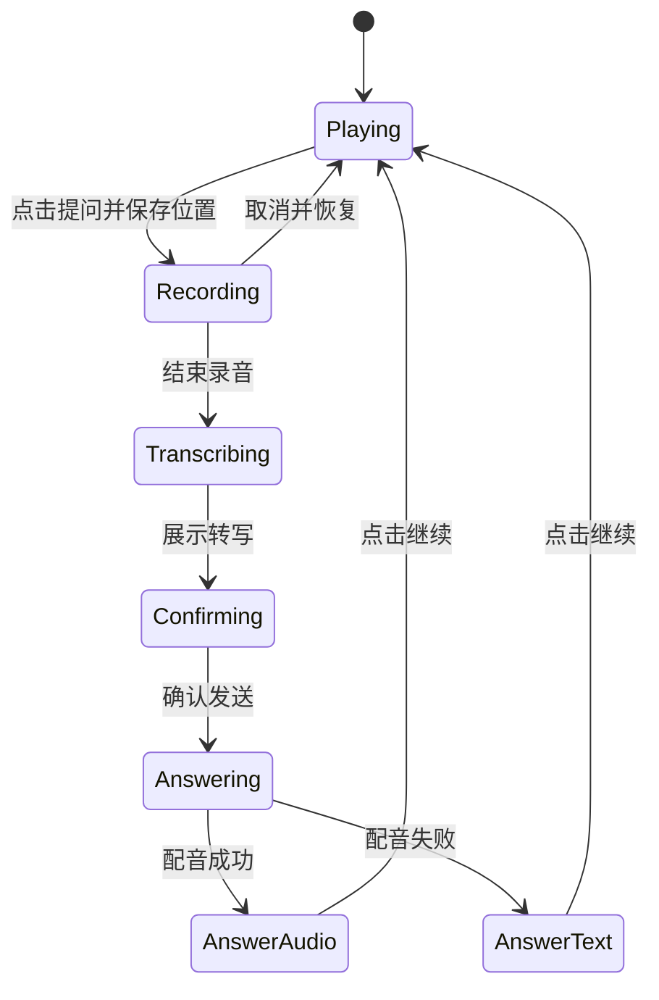

# 听海界面草图与状态流程

日期：2026-09-12。低保真文字原型，供开发对齐，不是已实现界面或最终视觉设计。

## 探索页

```text
听海                         关于
把知乎知识讲给你听，也听得见你的问题

今天想听懂什么？
[ 输入主题，例如：为什么天空是蓝色的       ]

选择讲述风格
[ 快板：有节奏地讲知识 ] [ 双人播客：边问边聊 ]

[ 开始生成 ]
示例主题：蓝天与晚霞 / 沉没成本 / 幸存者偏差
```

初始突出主题和风格选择。示例必须有经过核验的来源；预生成节目入口明确标识，不能伪装为现场生成。

## 生成页

```text
正在准备：为什么天空是蓝色的
风格：双人播客

当前阶段：正在整理讲述稿
已找到的资料 [标题 · 来源类型 · 查看原文]
节目大纲     1. 太阳光  2. 大气散射  3. 晚霞

[ 第一章已就绪，开始听 ]  （仅真实可播后启用）
```

状态为检索、整理讲稿、合成音频、部分可播、全部完成、失败。不展示没有后端依据的百分比。用户离开页面后以节目 ID 查询状态，避免重复提交付费任务。

## 收听页

```text
听海 / 为什么天空是蓝色的       双人播客

第 2 章：大气怎样改变光的方向
[ 上一章 ] [ 播放/暂停 ] [ 下一章 ]
01:20 ━━━━━●━━━━━━━━ 05:30

当前章节讲稿……
[ 章节目录 ] [ 资料来源 ]

         [ 按一下，语音提问 ]
                  也可以打字问
```

## 提问浮层

录音中显示“节目已暂停”、录音状态、结束录音和取消。识别后展示转写，允许编辑/确认发送；转写为空时可重录或打字。回答区展示回答文本、配音状态、来源及“继续收听”。



## 必须处理的状态

| 情况 | 界面反馈 | 恢复路径 |
| --- | --- | --- |
| 素材不足 | 说明无法支撑该主题 | 改主题或选择推荐示例 |
| 生成失败 | 标记失败阶段 | 仅重试失败章节，复用已生成内容 |
| 麦克风拒绝/不支持 | 显示文字输入 | 输入同一个问题 |
| 识别为空 | 不提交空问题 | 重录或文字输入 |
| 回答超时 | 保留转写及节目位置 | 重试或继续节目 |
| 浏览器禁止自动播放 | 显示播放按钮 | 用户点击开始 |

一时只有一条音轨播放。切换章节或节目时取消旧问答的播放请求。原型允许章节级讲稿；逐字同步字幕依赖模型时间戳，未验证前不承诺。
